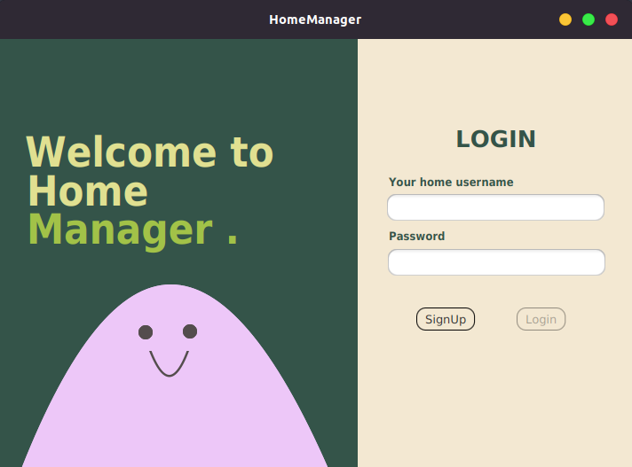

[](https://github.com/imetropoledigital/trabalho-final-matheus-costa-vidal)

<p>

</p>
O HomeManager é um aplicativo intuitivo e prático desenvolvido para simplificar a gestão de tarefas diárias e semanais em uma casa. Com o HomeManager, os membros de uma residência podem criar perfis individuais, cadastrar outros membros da casa e colaborar para manter a organização e eficiência nas atividades do lar.

## Índice
- 🔨 [Funcionalidades do projeto](#-funcionalidades-do-projeto)
- 📁 [Estrutura do projeto](#-estrutura-do-projeto)
- 📊 [Diagrama de classes](#-diagrama-de-classes)
- 💻 [Técnicas e tecnologias utilizadas](#-técnicas-e-tecnologias-utilizadas)
  - 📚 [Bibliotecas](#-bibliotecas)
  - 🗃️ [Estruturas de TADs](#%EF%B8%8F-estruturas-de-tads-tipos-abstratos-de-dados)
  - 🧩 [Templates](#-templates)
- 🔧 [Como compilar](#-como-compilar)
- 👥 [Autores](#-autores)
 
# 🔨 Funcionalidades do projeto
<p align="center">
  
</p>

<!--
<p align="center">
  
  
</p>

<p align="center">
      
      
      
</p>-->
O projeto HomeManager, um aplicativo dedicado ao gerenciamento eficiente de tarefas domésticas, oferece uma série de funcionalidades para promover a organização e colaboração dentro de uma residência:

- **Cadastro de Casa: 🏠** É possível criar um usuário de toda a casa, cadastrando os membros que residem;

- **Cadastro de Membros: 👥** Os usuários podem criar perfis individuais, inserindo informações pessoais como nome, foto e papel na casa (por exemplo, pai, mãe, filho);

- **Gestão de Tarefas Diárias e Semanais: 📅** Os membros podem cadastrar tarefas diárias e semanais, atribuindo responsabilidades específicas a cada membro da casa;
 
- **Definir Prioridades: ⭐️** Tarefas podem ser categorizadas e priorizadas para uma organização eficiente;

- **Distribuição Justa de Tarefas: ⚖️** Funcionalidade de distribuição equitativa de tarefas, garantindo que cada membro contribua de maneira justa para o funcionamento da casa. Tarefas são distribuídas aleatoriamente, levando em consideração o número de membros e a quantidade de tarefas disponíveis;

- **Acompanhamento do Progresso: 📈** Os membros podem marcar as tarefas como concluídas, proporcionando uma visão clara do progresso das atividades domésticas.

- **Estatísticas visuais 📊** Gráficos e estatísticas visuais auxiliam no monitoramento do desempenho individual e coletivo;

- **Privacidade e Segurança: 🔐** Prioriza a segurança dos dados, garantindo que informações pessoais e atividades domésticas estejam protegidas;

- **Visualização Geral: 👀** O aplicativo oferece uma visualização geral das tarefas, permitindo que os usuários vejam rapidamente todas as tarefas da casa;

- **Armazenamento em Arquivo Binário: 📁** Os dados da casa são armazenados em um arquivo binário, permitindo a recuperação dos dados para uso posterior;

- **Carregamento de Arquivo Binário: ⬆️** Todos os usuários são carregados partir de um arquivo binário, recuperando o estado anterior da casa;

- **Gravação em Arquivo de Texto (txt): 📝** O aplicativo oferece a opção de exportar o quadro Kanban para um arquivo de texto, permitindo salvar as informações em um formato legível;

- **Privacidade e Segurança: 🔐** Prioriza a segurança dos dados, garantindo que informações pessoais e atividades domésticas estejam protegidas.

O HomeManager é uma solução abrangente para famílias e casas compartilhadas, oferecendo uma abordagem colaborativa para o gerenciamento de responsabilidades diárias. Transforme a gestão doméstica em uma experiência organizada e eficiente com o HomeManager. ¡Sua casa, sua organização!

# 📁 Estrutura de diretórios
- **/docs:** Contém a documentação do projeto;
- **/imgs:** Imagens utilizada para a documentação;
- **/src:** Contém o código fonte do projeto;
  - **/application:** Contém a classe principal da aplicação;
  - **/controller:** Responsável por controladores da aplicação;
  - **/event:** Gerencia eventos para comunicação entre controladores;
  - **/model:** Contém os modelos (models) do projeto;
  - **/repository:** Repositório envolvendo operações de armazenamento e recuperação de dados;
- **/storage** Arquivo de dados salvo em binário (.dat) para recuperação;
- **.gitignore:** Arquivo do Git para ignorar arquivos no controle de versão;
- **README.md:** Documentação essencial do projeto em texto.

# 📊 Diagrama de classes
O diagrama de classes UML é uma representação visual da estrutura e das relações entre as classes em um projeto. Ele fornece uma visão geral da organização das classes, seus atributos e métodos, bem como as associações, heranças e dependências entre elas. Este diagrama é uma ferramenta poderosa para entender a arquitetura do sistema, identificar as principais entidades e suas interações, e facilitar o desenvolvimento, a manutenção e a comunicação entre os membros da equipe. Se você deseja explorar mais detalhes do diagrama de classes [clique aqui](docs/diagrama/) para ser redirecionado ao arquivo PDF correspondente.


# 💻 Técnicas e tecnologias utilizadas
<!--
<div style="display: flex; flex-wrap: wrap; justify-content: center; align-items: center;">
  
  
  
  
  
  
  
  
</div>-->

- Java;
- JavaFX;
- Javadoc;
- Maven;
- Git & Github;
- Diagrama UML;
- Modularização;
- Estrutura de dados;
- Design Patterns;
- Arquitetura Model-View-Controller;
- Separation of Concerns;
- Manipulação de arquivos;
- Programação Orientada a Objetos.

## 🗃️ Estruturas de TADs (Tipos Abstratos de Dados)
Este assunto é implementado no arquivo [estruturas_tads.hpp](include/estruturas_tads.hpp). Consulte esse arquivo para obter mais detalhes e implementação relacionada.

<!-- ## 🧩 Templates
Este assunto é implementado no arquivo [templates.hpp](include/templates.hpp). Consulte esse arquivo para obter mais detalhes e implementação relacionada.
### 1. Algoritmos de Ordenação-->

# 🔧 Como compilar?
O aplicativo utiliza o Maven para facilitar o processo de compilação e execução. Siga as etapas abaixo para compilar e executar o projeto:

## Pré-requisitos
Certifique-se de ter o compilador g++ instalado em seu sistema antes de prosseguir.

### Passo 1: Obtenha o código-fonte
Clone o repositório do projeto em seu ambiente local ou faça o download dos arquivos fonte em um diretório de sua escolha.

### Passo 2: Navegue para o diretório do aplicativo
Abra um terminal e navegue até o diretório raiz do projeto usando o comando cd:<br>
```
cd caminho/para/o/diretorio/do/projeto/HomeManager
```

### Passo 3: Compile e Execute o aplicativo
Execute o seguinte comando para compilar o aplicativo: <br>
```
mvn clean javafx:run
```
<br>
Isso iniciará o processo de compilação, baixando as dependências do Maven e executando o aplicativo JavaFX.

## Observações
- Certifique-se de que o arquivo pom.xml está presente no diretório raiz do projeto antes de executar o comando Maven.
- Ao finalizar a compilação, o aplicativo JavaFX será iniciado automaticamente.

## Em caso de dúvidas
Se você encontrar qualquer problema ou precisar de mais informações sobre como compilar o projeto, consulte a documentação do Maven ou entre em contato com a equipe de desenvolvimento.

O uso do Maven simplifica o processo de compilação e gestão de dependências, proporcionando uma experiência mais eficiente no desenvolvimento do projeto HomeManager.

# 👥 Autores

| [<br><sub>Isabela Gomes</sub>](https://github.com/cyberisa) |  [<br><sub>Matheus Vidal</sub>](https://github.com/matheusvidal21) |
| :---: | :---: |
